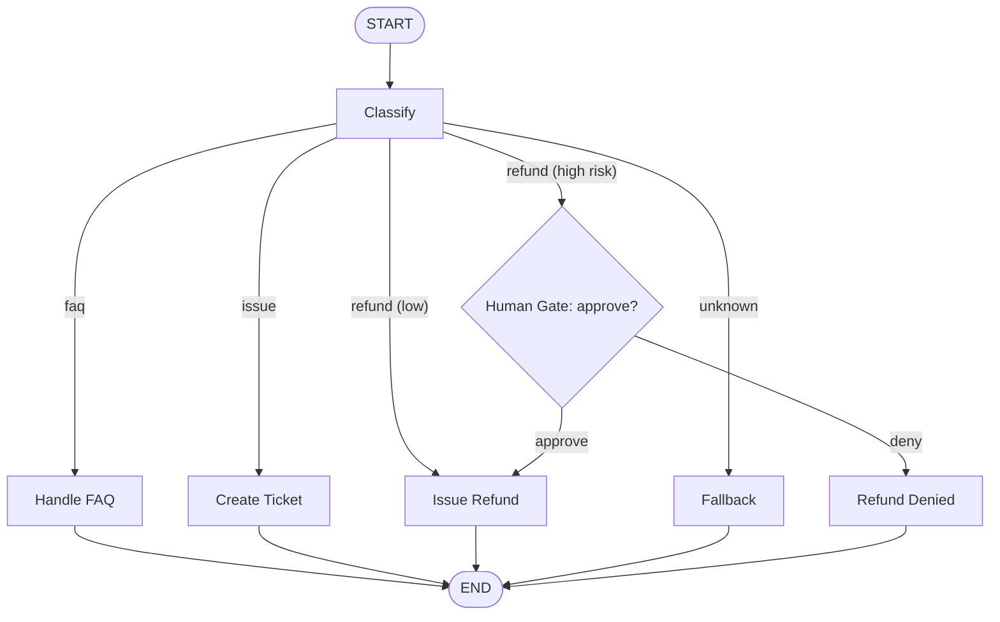

# Support Triage Autopilot (LangGraph 1.0)

A tiny but real **LangGraph** app that demonstrates stateful control‑flow, a **human approval gate** (interrupt → resume), and persisted state via a SQLite checkpointer. Product managers can use this as a pattern for “stop‑before‑money/legal” workflows.


## Why LangGraph (not just one LLM call)?
- **Declarative graph**: route by intent (`faq` / `issue` / `refund`) with explicit nodes.
- **Human-in-the-loop**: `interrupt()` pauses at risky steps; resume with a decision via `Command(resume=...)`.
- **Persistence**: SQLite checkpointer for durable threads and resumability.

## Demo UI
A single-page app (served by FastAPI) shows three roles—**Customer**, **Autopilot (Graph)**, and **Reviewer (Human)**—and a Mermaid diagram of the flow. Refunds trigger a pause and surface an **Approve / Deny** control; your choice resumes the graph deterministically.

## Quickstart (Python 3.12)
```bash
python -m venv .venv && source .venv/bin/activate
pip install -r requirements.txt
python -m uvicorn app:app --reload --port 8000
# UI → http://127.0.0.1:8000/ui/
```

### cURL examples
FAQ (no pause):
```bash
curl -s http://127.0.0.1:8000/chat -H "Content-Type: application/json" \
  -d '{"message":"What are your hours?"}'
```
Refund (pauses, returns thread_id):
```bash
curl -s http://127.0.0.1:8000/chat -H "Content-Type: application/json" \
  -d '{"message":"Please refund $19"}'
```
Resume with approval:
```bash
curl -s http://127.0.0.1:8000/chat -H "Content-Type: application/json" \
  -d '{"thread_id":"<copy-from-above>","message":"resume","approval":true}'
```

## Requirements
Pinned for Python **3.12** for maximum wheel compatibility:

```
fastapi==0.115.0
uvicorn==0.38.0
pydantic==2.9.2
typing-extensions==4.15.0

# LangGraph 1.0 + SQLite checkpointer
langgraph==1.0.2
langgraph-checkpoint==3.0.0
langgraph-checkpoint-sqlite==3.0.0
```
> If you see import/version mismatches, ensure your venv Python is 3.12 and that the above versions are installed.

## Project structure
```
.
├─ app.py                # FastAPI app + LangGraph (interrupt + resume)
├─ kb.json               # Tiny FAQ KB
├─ requirements.txt
└─ ui/
   ├─ index.html         # UI with Mermaid diagram
   ├─ app.js             # Chat + approval client logic
   └─ styles.css
```

## API
**POST `/chat`**
- Request:
  - `message` (string) — user message (required)
  - `thread_id` (string) — continue a prior thread (optional)
  - `approval` (bool) — only on resume after a pause
- Response:
  - If paused: `{ status: "PAUSED_FOR_APPROVAL", thread_id, interrupt: {...} }`
  - If done: `{ status: "DONE", intent, risk, action_result, messages, thread_id }`

## Diagram (Mermaid)


## Portfolio notes (for PM use)
- **Safe automation**: graph pauses on refunds, requires human approval, then resumes.
- **Explainable flow**: explicit nodes & edges, easy to walk through in interviews.
- **Small, readable codebase**: ideal for showcasing product judgment with technical depth.

## License
MIT — see [LICENSE](./LICENSE).
